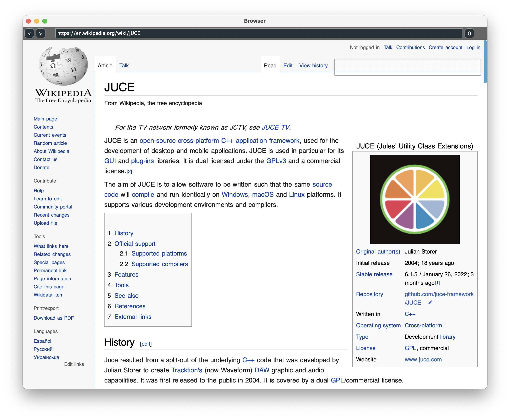

# JUCE litehtml
This is a JUCE module that provides integration of the [litehtml](https://github.com/litehtml/litehtml) HTML/CSS rendering engine with JUCE backend.



The web pages can be loaded from network (via http or https), but also locally, from a file or JUCE application binary resources.

This module also attempts to add JavaScript support on top of the litehtml using [quickjs](https://github.com/bellard/quickjs) interpreter.

Litehtml offers rather limited capabilities, but it is good enough to render rich documents, which can be useful, for example, to show help pages or documentation within JUCE applications or plugins.

> This project is WIP.

## Compilation

This module must be used via CMake (cannot be used from Projuces because of additional targets that need to be compiled).

Add [JUCE](https://github.com/juce-framework/JUCE) and [juce_litehtml](https://github.com/Archie3d/juce_litehtml) submodules to your project, and then link additional `juce::juce_litehtml` library on your target:

```CMake
add_subdirectory(JUCE)
add_subdirectory(juce_litehtml)

target_link_libraries(${TARGET}
    PRIVATE
        juce::juce_core
        juce::juce_core
        juce::juce_data_structures
        juce::juce_gui_basics

        juce::juce_litehtml

        juce::juce_recommended_config_flags
)
```

[See the test project](https://github.com/Archie3d/juce_litehtml_test) for an example.
